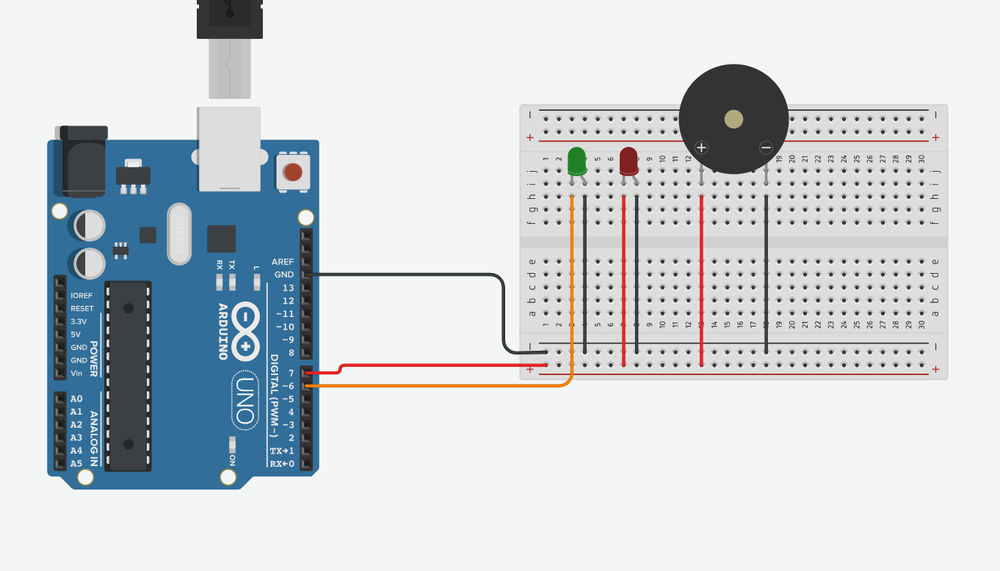

# Driver Drowsiness Detection System

Real-time driver monitoring using OpenCV, MediaPipe Face Mesh, and Arduino-based alerts.

The system watches a live webcam feed, tracks eye openness using the Eye Aspect Ratio (EAR), and sends a serial command to an Arduino when the driver appears drowsy.

## Overview

This project is a lightweight computer vision prototype for detecting prolonged eye closure while driving.

When the EAR stays below the configured threshold for a set time, the Python app sends:

- `A` for alert state, meaning the driver may be sleeping
- `R` for recovery state, meaning the driver is awake again

## Preview



## Features

- Real-time webcam monitoring
- Face landmark detection with MediaPipe
- EAR-based eye closure detection
- Serial communication with Arduino
- Visual status display in the camera window

## Repository Structure

```text
.
|-- Main.py
|-- Arduino_Code.ino
|-- hardware.txt
|-- Circuit.png
|-- haarcascade_eye.xml
|-- haarcascade_frontalface_default.xml
|-- .gitignore
`-- README.md
```

## Files

- [Main.py](Main.py) - main Python application
- [Arduino_Code.ino](Arduino_Code.ino) - Arduino sketch for alert output
- [Circuit.png](Circuit.png) - wiring reference
- [hardware.txt](hardware.txt) - hardware parts list
- [haarcascade_eye.xml](haarcascade_eye.xml) - OpenCV eye cascade asset
- [haarcascade_frontalface_default.xml](haarcascade_frontalface_default.xml) - OpenCV face cascade asset


### Hardware

- Arduino UNO
- Red LED
- Green LED
- Buzzer
- Webcam

### Software

- Python 3.10+
- Arduino IDE

## Installation

1. Install the Python dependencies:

```bash
pip install -r hardware.txt
```

2. Upload the Arduino sketch from `Arduino.ino.ino` to your board.

3. Confirm the Arduino COM port in `Main.py`:

```python
arduino = serial.Serial('COM5', 9600, timeout=0)
```

If your board uses a different port, change `COM5` accordingly.

## Run

Start the application with:

```bash
python Main.py
```

The camera window will open and show:

- detected eye landmarks
- EAR value
- current driver status

Press `q` to exit.

## Detection Logic

The current configuration uses:

- EAR threshold: `0.23`
- closed-eye duration: `2 seconds`

You can tune both values in `Main.py` to make the system more or less sensitive.

## Arduino Behavior

The Arduino sketch listens for serial commands:

- `A` turns on the alert output
- `R` restores the normal state

## Notes

- The project uses MediaPipe Face Mesh for eye tracking, so the Haar cascade files are not required by the current main script.
- `hardware.txt` is intentionally kept as a hardware list for reference.

## Troubleshooting

- If the camera does not open, make sure no other application is using it.
- If the Arduino does not respond, confirm the COM port and baud rate.
- If Python reports missing modules, reinstall the packages listed in `requirements.txt`.
- If the system is too sensitive, raise the EAR threshold or increase the closed-eye duration.

## License

No license file is included yet. Add one before publishing publicly if you want to define reuse terms.
